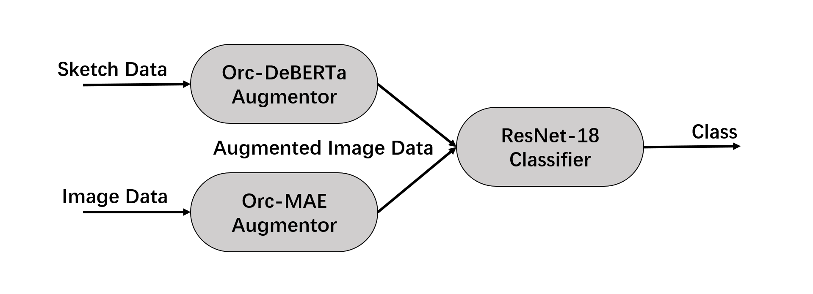

Orc-DeBERTa, Orc-MAE and others: Unsupervised Few-Shot Oracle Character Recognition
===================================================================================

Requirement
-----------

`argparse`: to run the project by a given mode with given hyper-parameters from
the command line;

`warnings`: to filter warnings;

`os`: to implement file operations;

`time`: to record the log and result named by current time;

`logging`: to record the log without including the progress bar;

`tqdm`: to show the progress bar when loading data;

`numpy`: to get random numbers and implement mathematical calculations;

`torch`: to manage the use of GPU and construct the network;

`torchvision`: to load the pre-trained ResNet-18;

`transformers`: to construct the DeBERTa model;

`matplotlib`: to convert the sketch data into image data.

Code Files
----------

`rename.py`: rename the original Chinese file names to numbers, since some
operating systems may not support Chinese;

`draw.py`: convert the large-scale unlabeled sketch data into image data, since
paired sketch and image data are need in DeBERTa, while the original dataset
doesn’t provide such form of data;

`load.py`: define the `OracleDataset` class and the `data_loader_builder`
function to load different forms of data;

`augment.py`: define three functions to implement CutOut, MixUp and CutMix;

`deberta.py`: define the structure of Orc-DeBERTa;

`utils.py`: define the training and pre-training processes;

`main.py`: collect the command from the command line, load the data using the
`data_loader_builder` function defined in `load.py`, instantiate the model and
implement the training and pre-training processes defined in `utils.py`.

Data Pre-processing
-------------------

All the data should be stored in the `Data` directory in the root directory of
the project, just like the `Code` directory.

The structure of the raw [Oracle-FS​](https://github.com/wenhui-han/Oracle-50K) dataset file is as follows:

~~~~~~~~~~~~~~~~~~~~~~~~~~~~~~~~~~~~~~~~~~~~~~~~~~~~~~~~~~~~~~~~~~~~~~~~~~~~~~~~
--oracle_source
  --oracle_source_img
    --bun_xxt_hard
    --gbk_bronze_lst_seal
    --oracle_54081
    --other_font
  --oracle_source_seq
--oracle_fs
  --img
    --oracle_200_1_shot
      --test
      --train
    --oracle_200_3_shot
      --test
      --train
    --oracle_200_5_shot
      --test
      --train
  --seq
    --oracle_200_1_shot
    --oracle_200_3_shot
    --oracle_200_5_shot
~~~~~~~~~~~~~~~~~~~~~~~~~~~~~~~~~~~~~~~~~~~~~~~~~~~~~~~~~~~~~~~~~~~~~~~~~~~~~~~~

To better manage the files, we reconstruct them as follows:

~~~~~~~~~~~~~~~~~~~~~~~~~~~~~~~~~~~~~~~~~~~~~~~~~~~~~~~~~~~~~~~~~~~~~~~~~~~~~~~~
--img
  --oracle_source_img
    --bun_xxt_hard
    --gbk_bronze_lst_seal
    --oracle_54081
    --other_font
  --oracle_200_1_shot
    --test
    --train
  --oracle_200_3_shot
    --test
    --train
  --oracle_200_5_shot
    --test
    --train
--seq
  --oracle_source_seq  
  --oracle_200_1_shot
  --oracle_200_3_shot
  --oracle_200_5_shot
--draw
  --train
  --test
~~~~~~~~~~~~~~~~~~~~~~~~~~~~~~~~~~~~~~~~~~~~~~~~~~~~~~~~~~~~~~~~~~~~~~~~~~~~~~~~

Besides reconstruct the `Data/img` and `Data/seq` files by oneself, one can run
`rename.py` to rename the the original Chinese file names to numbers, and run
`draw.py` to convert the large-scale unlabeled sketch data into image data.

Training
--------

One can run the following command in the command line to train the models:

~~~~~~~~~~~~~~~~~~~~~~~~~~~~~~~~~~~~~~~~~~~~~~~~~~~~~~~~~~~~~~~~~~~~~~~~~~~~~~~~
python main.py --mode train --form baseline --shot 1 --lr 0.0001
python main.py --mode train --form tradition --shot 1 --lr 0.0001
python main.py --mode train --form cutout --shot 1 --lr 0.0001
python main.py --mode train --form mixup --shot 1 --lr 0.0001
python main.py --mode train --form cutmix --shot 1 --lr 0.0001
python main.py --mode pretrain --form img --lr 0.001
python main.py --mode train --form img --shot 1 --lr 0.0001
python main.py --mode pretrain --form seq --lr 0.001
python main.py --mode train --form seq --shot 1 --lr 0.0001
~~~~~~~~~~~~~~~~~~~~~~~~~~~~~~~~~~~~~~~~~~~~~~~~~~~~~~~~~~~~~~~~~~~~~~~~~~~~~~~~

More specifically, the following parameters can be set:

`--num_epoch`: the number of epochs. Since the so far best model will always be
saved, the number of epochs seems to be not so important. Default: `200`.

`--batch_size`: the batch size. Default: `8`.

`--num_workers`: the number of sub-processes to use for data loading. Default:
`4`.

`--mode`: the mode, can be `train` or `pretrain`. Default: `Train`.

`--form`: the data augmentation strategy, which can be `baseline`, `tradition`,
`cutout`, `mixup`, `cutmix`, `img` and `seq`, where `baseline` means no data
augmentation strategy, `tradition` means random padding, cropping and horizontal
flipping, `img` means Orc-MAE, and `seq` means Orc-DeBERTa. Default: `img`.

`--shot`: the few shot setting, which can be `1`, `3` or `5`. Default: `1`.

`--lr`: the learning rate. Default: `0.0001`.
